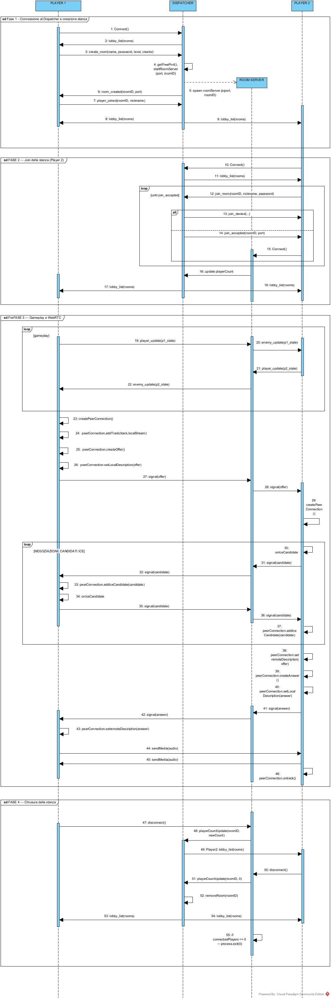

# RT-Shooter - Real-Time 1v1 Shooter Game


---

<p align="center">
  
</p>


RT-Shooter è un gioco FPS multiplayer 1v1 che può essere giocato direttamente nel browser. La game UI (Frontend) è sviluppata con **React** ed il dispatcher (Backend) con **Node.js**. Inoltre, il gioco utilizza **WebRTC** per la comunicazione in tempo reale, Socket\.IO per gestire la sincronizzazione tra i client (passando sempre per il server), e **WebAssembly** per un motore di gioco reattivo e performante.

---
1. [**Caratteristiche Principali**](#caratteristiche-principali)
2. [**Tecnologie Utilizzate**](#tech-stack)
3. [**Setup del Progetto**](#setup-del-progetto)
4. [**Game engine**](#game-engine)
5. [**Outline del Progetto**](#outline-del-progetto)
6. [**Descrizione dei componenti principali**](#descrizione-dei-componenti-principali)
7. [**Sequence Diagram**](#sequence-diagram)
---
## Caratteristiche principali

- Chiamata Vocale peer-to-peer per interazione tra i giocatori con **WebRTC**
- Sincronizzazione dei movimenti, degli eventi tra i giocatori e della chat testuale via **Socket\.IO**
- Motore di gioco sviluppato in **C++** con **OpenGL** e compilato in **WebAssembly** con **Emscripten**
- Interfaccia moderna e responsive con **React**
- creazione on–demand di stanze dedicate attraverso il dispatcher (**Node.js**)

---

## Interfaccia dell'app

### Schermata principale

<div style="display: flex; gap: 10px;">
  
  
</div>

---

## Modalità di gioco

### Sparatutto 1v1


---

# Tech Stack

- **React** : Una libreria JavaScript per costruire interfacce utente dinamiche e scalabili, utilizzata per gestire la navigazione e l’interazione dell’utente nelle applicazioni web. 
- **WebRTC** : Tecnologia che consente la comunicazione in tempo reale peer-to-peer direttamente tra browser, utilizzata per la chiamata vocale nel gioco.
- **Node.js** : Ambiente di esecuzione JavaScript lato server, utilizzato per gestire il dispatcher del gioco.
- **Socket\.IO** : Libreria per la comunicazione in tempo reale bidirezionale tra client e server, utilizzata per la sincronizzazione degli eventi di gioco.
- **WASM** : WebAssembly, utilizzato per eseguire codice **C++** compilato ad alte prestazioni nel browser.
- **CSS** : linguaggio di stile utilizzato per definire l'aspetto visivo dell'interfaccia utente.

---

# Setup del progetto

Per avviare il progetto, segui questi passaggi:

### 1. **Clone della repository**
```
git clone https://github.com/WebRTC-Projects-Unina/RT-Shooter
```
### 2. **Installare Node.js**
 
Il progetto richiede **Node.js** (versione 18 o superiore) per gestire le dipendenze. Puoi scaricare e installare Node.js dal [sito ufficiale](https://nodejs.org/).
 
Verifica di avere la versione corretta di Node.js eseguendo:
 
```bash
node -v
```
## 3. **Installare le Dipendenze (Frontend)**
 
Accedi alla cartella  game-ui e installa le dipendenze necessarie utilizzando **npm**
```
cd RT-Shooter/game-ui
npm install
```
## 4. **Installare le Dipendenze (Backend)** 
Accedi alla cartella dispatcher e installa le dipendenze necessarie utilizzando **npm**
```
cd ../dispatcher
npm install
```
## 5. **Fai partire il dispacher (server node)**
Il dispatcher parte sulla porta 8080
```
node .\server.js
```
## 6. **Fai partire l'app React**
App React parte sulla porta 3000
```
cd ../game-ui
npm start
```

# Game engine

I file test.js e test.wasm e test.data presenti nella cartella public del frontend, sono stati generati utilizzando **Emscripten** a partire da un codice sorgente scritto in **C++**, che si trova nella cartella game.

Anche se per il corretto funzionamento del gioco sono necessari solo i file .data .js e .wasm nella cartella public dentro game-ui, è importante fare riferimento al codice sorgente **C++** per completezza. La cartella game contiene il motore di gioco, che è stato sviluppato in **C++** e successivamente compilato in WebAssembly (**WASM**) tramite **Emscripten** per essere eseguito direttamente nel browser.

Questo approccio ci permette di mostrare come il gioco viene implementato inizialmente in **C++** prima di essere compilato in **WASM**, anche se nella versione finale del gioco sono richiesti solo i file generati ( .data .wasm e .js).

Se si volesse modificare la logica di gioco o qualsiasi pezzo di codice inerente al game engine è necessario effettuare le modifiche e poi ricompilare il tutto con **Emscripten**.

## Installazione Emscripten

Fermo restando che tutte le specifiche di **Emscripten** possono essere trovate nella seguente repository Github: https://github.com/Emscripten-core/emsdk.git
Ecco 4 semplici step per installarlo:

### 1. **Clone della repo**
```
git clone https://github.com/Emscripten-core/emsdk.git
```
### 2. **Installa l'ultima versione**
```
cd emsdk
./emsdk install latest
```

### 3. **Attiva il tutto**
> [!IMPORTANT]
> Probabilmente è necessario riavviare il pc per far si che le variabili d'ambiente vengano settate correttamente. 


> [!NOTE]
> Il flag **--permanent** fa si che **Emscripten** attivi la versione richiesta in modo permanente.
Questo significa che l'ambiente di **Emscripten** verrà automaticamente caricato ogni volta che apri una nuova finestra del terminale. 
Senza il flag dovrei ogni volta in volta eseguire eseguire manualmente source ./emsdk_env.sh.  
A voi la scelta !  


```
./emsdk activate latest --permanent
```
### 4. **Verifica Installazione**
Per verificare la corretta installazione usare il seguente comando:
```
emcc -v
```

## Comando per la compilazione con Emscripten

Il comando è presente interamente in **RT-Shooter/game/README.md**.  

I nuovi file generati ( .data .wasm e .js) sovrascriveranno automaticamente i precedenti.
Per comodità è stato scritto un Makefile.
Per compilare entrare, quindi, nella cartella game ed eseguire il comado make.
Ecco la procedura:
```
cd RT-Shooter/game
make
```
# Outline del Progetto
La struttura del progetto RT-Shooter è organizzata in diverse cartelle principali, ciascuna con uno scopo specifico
```
/RT_SHOOTER
  /dispatcher
    roomServer.js
    server.js
  /game-ui
    /public
      /assets
        (varie immagini e icone)
      favicon.ico
      index.html
      test.data
      test.js
      test.wasm
    /src
      /components
        CreateRoomPage.jsx
        Game.jsx
        MainMenu.jsx
        NicknameModal.jsx
        PasswordModal.jsx
        RoomlistPage.jsx
        Settings.jsx
      /styles
        createRoomPage.css
        game.css
        mainMenu.css
        nickname.css
        passwordModal.css
        index.css
        roomlist.css
        settings.css
      App.js
      DispatcherSocket.js
      index.js
    (varie configurazioni di progetto)
  /game
    (file sorgente C++ del motore di gioco e Makefile per la compilazione con  
    Emscripten)

```

# Descrizione dei componenti principali

### `App.js`
 
- **Funzione**: Gestisce la navigazione tra le schermate dell'applicazione.
Ogni schermata ha un proprio componente **React** (**.jsx**) dedicato che viene importato e utilizzato in App.js per creare un flusso di navigazione coerente.
- **Schermate**:
  - **Main Menu**: Schermata principale del gioco con opzioni per iniziare una nuova partita, accedere alle impostazioni o visualizzare i crediti.
    - **Nickname Input Page**: Schermata per inserire il nickname del giocatore prima di accedere al gioco.
      - **Lobby**: Room list page Schermata che mostra l'elenco delle stanze di gioco disponibili e consente di unirsi a una stanza esistente.
        - **Create Room Page**: Schermata per creare una nuova stanza di gioco.
        - **Password Input Page**: Schermata per inserire la password di una stanza protetta prima di accedervi.
          - **Game Screen**: Schermata principale di gioco dove avviene l'azione di gioco vera e propria.
  - **Settings**: Schermata per configurare le impostazioni audio e video.
  - **Credits**: Schermata che mostra le informazioni sugli sviluppatori del gioco.
  
### `MainMenu.jsx`

**Funzione**: Questo componente rappresenta il menu principale dell'applicazione, dove l'utente può accedere a diverse opzioni, tra cui avviare una partita 1v1, modificare le impostazioni e visualizzare i crediti.

**Stato**: Il componente non gestisce stato interno, ma si basa su funzioni passate come props (`onPlay1v1`, `onSettings`, `onCredits`) per gestire le azioni che l'utente compie.

**Funzioni principali**:
- **onPlay1v1**: Funzione passata come prop che viene chiamata quando l'utente seleziona l'opzione "Play 1v1". In genere, avvia una nuova partita 1v1.
- **onSettings**: Funzione passata come prop che viene chiamata quando l'utente seleziona l'opzione "Settings". Consente di accedere alle impostazioni del gioco.
- **onCredits**: Funzione passata come prop che viene chiamata quando l'utente seleziona l'opzione "Credits". Mostra i crediti del gioco.

### `NicknameModal.jsx`

**Funzione**: Questo componente mostra una finestra modale che consente all'utente di inserire un soprannome prima di entrare nel gioco. L'utente può confermare il soprannome o tornare indietro.

**Stato**:
- **nickname**: Memorizza il valore del soprannome inserito dall'utente.
  
**Funzioni principali**:
- **useEffect()**: Gestisce il focus automatico sul campo di input quando il componente viene caricato.
- **handleConfirm()**: Verifica che il soprannome non sia vuoto e, se valido, chiama la funzione `onConfirm` con il soprannome.

### `RoomList.jsx`

**Funzione**: Questo componente gestisce la lista delle stanze disponibili per il gioco. Consente agli utenti di unirsi a stanze esistenti o di creare nuove stanze. Se la stanza è protetta da password, l'utente verrà richiesto di inserire la password.

**Stato**:
- **rooms**: Lista delle stanze disponibili ricevuta dal server.
- **askingPassword**: Determina se la finestra modale per l'inserimento della password è visibile.
- **wrongPassword**: Indica se la password inserita dall'utente è errata.

**Funzioni principali**:
- **useEffect()**: All'inizializzazione del componente, richiede la lista delle stanze disponibili e ascolta gli eventi del server per aggiornare la lista o gestire la risposta di un tentativo di accesso alla stanza.
- **handleJoin(room)**: Gestisce la logica per unirsi a una stanza. Se la stanza richiede una password, mostra la finestra di inserimento password, altrimenti tenta di entrare nella stanza.

### `PasswordModal.jsx`

**Funzione**: Questo componente mostra una finestra modale che richiede all'utente di inserire una password per accedere a una stanza di gioco protetta. Se la password è errata, viene mostrato un messaggio di errore.

**Stato**:
- **password**: Memorizza il valore inserito dall'utente nel campo di input per la password.
- **error**: Contiene il messaggio di errore se la password inserita è errata.

**Funzioni principali**:
- **useEffect()**: Gestisce il focus automatico sul campo di input della password quando il componente viene caricato e resetta l'errore se la password è sbagliata.

### `CreateRoomPage.jsx`

**Funzione**: Questo componente consente all'utente di creare una nuova stanza di gioco. L'utente può scegliere un nome per la stanza, impostare una password opzionale e selezionare una delle 3 mappe disponibili. Una volta creata la stanza, l'utente viene indirizzato alla schermata di gioco.

**Stato**:
- **roomName**: Memorizza il nome della stanza inserito dall'utente.
- **password**: Memorizza la password della stanza, se fornita.
- **level**: Memorizza il livello (mappa) selezionato (Level 1, Level 2, Level 3).
- **levelImage**: Memorizza l'immagine di anteprima del livello selezionato.
- **error**: Memorizza eventuali messaggi di errore, come il nome della stanza mancante.

**Funzioni principali**:
- **updateLevelImage()**: Aggiorna l'immagine di anteprima in base al livello selezionato.
- **createRoom()**: Crea una nuova stanza inviando le informazioni al server. Se il nome della stanza è vuoto, mostra un errore.
- **useEffect()**: Gestisce l'effetto di aggiornamento dell'immagine di anteprima del livello e la configurazione della creazione della stanza. Ascolta l'evento "room_created" dal server per reindirizzare l'utente alla schermata di gioco.

## `server.js`  (Dispatcher) 

**Funzione**  
Il Dispatcher è il server centrale dell’applicazione. Gestisce la lobby, mantiene la lista delle stanze disponibili e si occupa di creare nuovi “room server” come processi figli, assegnando loro una porta dedicata. Fornisce inoltre la UI React in produzione e gestisce tutta la comunicazione iniziale tramite Socket\.IO.

**Stato**
- **rooms**: Array che contiene tutte le stanze attive (ID, nome, creator, livello, porta assegnata, stato, playerCount).
- **roomProcesses**: Mappa che associa ogni roomID al processo figlio corrispondente, utile per monitorare e terminare automaticamente le stanze.
- **buffer**: Buffer temporaneo per raccogliere output JSON proveniente dai processi figli prima del parsing.

**Funzioni principali**

- **Gestione lobby (Socket\.IO)**  
  - `lobby_list`: Invia ai client la lista aggiornata delle stanze.  
  - `request_lobby_list`: Risponde a una richiesta esplicita inviando nuovamente la lista.

- **join_room({ roomID, nickname, password })**  
  Gestisce la richiesta di ingresso in una stanza:
  - verifica se la stanza esiste;  
  - se la stanza è protetta, valida la password;  
  - controlla il numero di giocatori;  
  - in caso positivo, invia al client le informazioni per connettersi al room server (roomID e porta).

- **create_room(data)**  
  Crea una nuova stanza:  
  - genera ID univoco;  
  - assegna una porta libera con `getFreePort()`;  
  - avvia il processo figlio tramite `startRoomServer()`;  
  - salva la stanza nella lista;  
  - notifica il creatore con l'evento `room_created`.

- **getFreePort(start = 9000)**  
  Trova una porta libera scandendo le porte disponibili a partire da 9000, evitando quelle già assegnate alle altre stanze.

- **startRoomServer(port, roomID)**  
  Avvia un room server come processo figlio:
  - esegue `roomServer.js` con porta e ID stanza;  
  - ascolta l’output del processo per aggiornare il numero di giocatori nella stanza;  
  - se il processo si chiude o genera errore, rimuove automaticamente la stanza dalla lobby;  
  - aggiorna tutti i client inviando `lobby_list`.

- **Static File Serving**  
  In modalità produzione serve la UI React compilata tramite:
  - `express.static("../game-ui/build")`  
  - fallback `index.html` per supportare SPA routing.


### `RoomServer.js`

**Funzione**  
Il Room Server è il processo figlio generato dal Dispatcher. Gestisce la comunicazione in tempo reale tra i due giocatori all’interno della stanza. Tiene traccia dei giocatori connessi, trasmette gli eventi WebRTC (offer/answer/candidate) e inoltra gli aggiornamenti di gioco (posizioni, movimenti, ecc.).  

Ogni room server funziona in modo completamente indipendente e termina automaticamente quando tutti i giocatori si disconnettono.


**Stato**
- **connectedPlayers**: Numero di giocatori attualmente connessi alla stanza.  
- **port**: Porta su cui il room server è in ascolto (passata come argomento dal Dispatcher).  
- **roomID**: Identificativo univoco della stanza (passato come argomento dal Dispatcher).


**Funzioni principali**

- **Gestione connessione Socket\.IO**
  - Quando un giocatore si connette:
    - incrementa `connectedPlayers`;
    - notifica il Dispatcher inviando JSON su `stdout`;
    - notifica tutti i client con l’evento `playerCount`.
  
  - Quando un giocatore si disconnette:
    - decrementa `connectedPlayers`;
    - aggiorna il Dispatcher tramite `stdout`;
    - se la stanza diventa vuota (`connectedPlayers === 0`), il server termina automaticamente con `process.exit(0)`.

- **join_game**
  Evento ricevuto quando un giocatore entra ufficialmente nella partita.  
  Il server ritrasmette ai client il numero aggiornato di giocatori.


- **player_update**
  Riceve un aggiornamento di stato del giocatore (movimento, posizione, input di gioco) e lo ritrasmette all’altro giocatore tramite `enemy_update`.

- **WebRTC Signaling**
  Il room server gestisce il signaling necessario per stabilire la connessione P2P tra i client:
  - `offer`: inviata da un client → ritrasmessa all’altro.
  - `answer`: risposta del secondo client → ritrasmessa al primo.
  - `candidate`: candidati ICE → ritrasmessi all’altro peer.

  Il server non interpreta questi messaggi: li passa semplicemente da un giocatore all’altro.


- **Comunicazione con il Dispatcher**
  - Ricezione messaggi dal processo padre tramite `stdin`.  
  - Invio continuo dello stato stanza (roomID + playerCount) tramite `stdout`.  
  Questo permette al Dispatcher di aggiornare la lobby in tempo reale.


**Avvio del server**  
Il Room Server viene avviato come processo figlio dal Dispatcher e si mette in ascolto sulla porta assegnata.  
Al momento dell’avvio stampa nel terminale un messaggio di conferma nel formato:

#### `Room Server for [roomID] started on port [port]`
---

## Sequence Diagram
 
 



