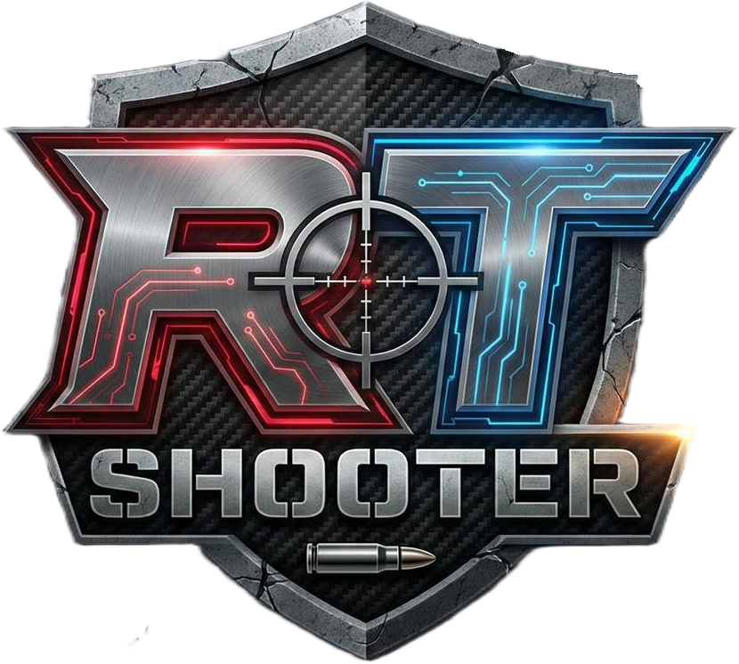
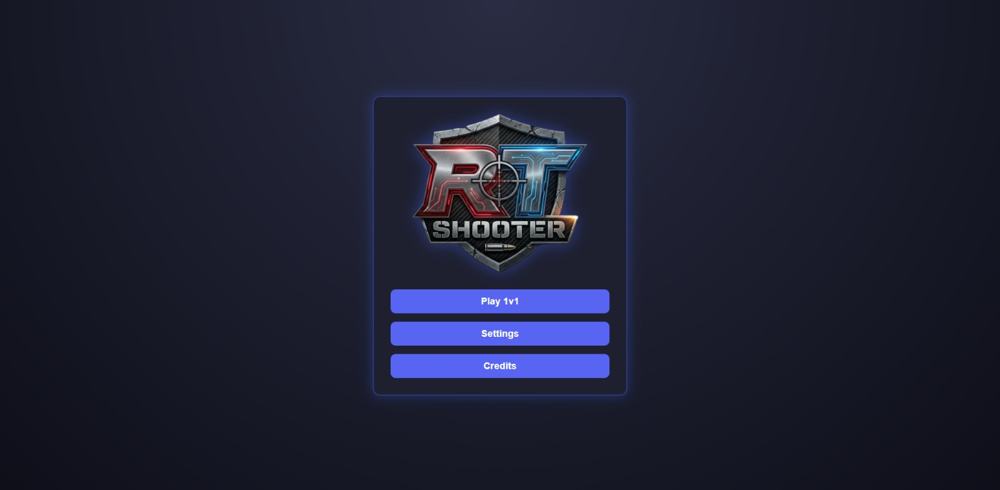
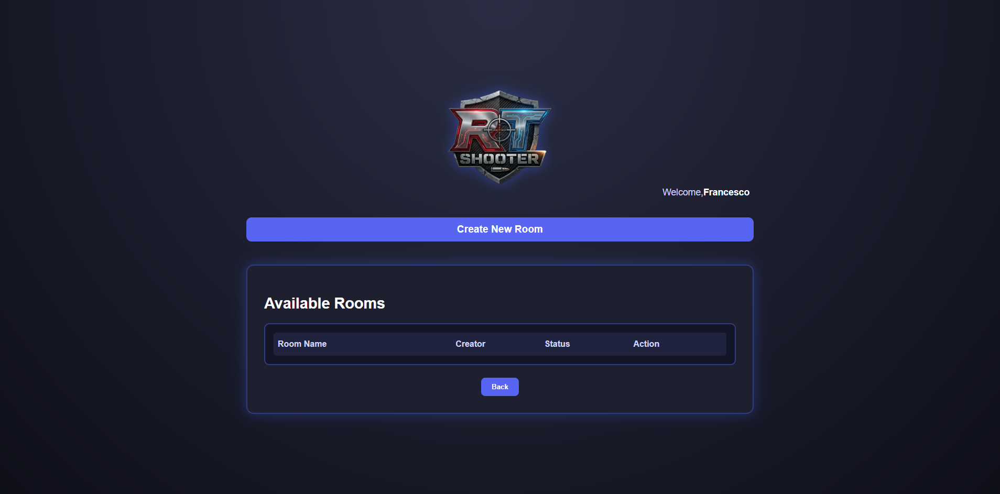

# RT-Shooter - Real-Time 1v1 Shooter Game

Un gioco multiplayer 1vs1 in tempo reale, sviluppato con **React**, **Node.js**, **Socket.IO**, e **WebAssembly (WASM)** per il motore di gioco.

---

<p align="center">
  
</p>


RT-Shooter è un gioco shooter multiplayer 1v1 che può essere giocato direttamente nel browser. Il gioco utilizza **WebRTC** per la comunicazione in tempo reale, Socket.IO per gestire la sincronizzazione tra i client, e **WebAssembly** per un motore di gioco reattivo e performante.

---

## Caratteristiche principali

- Gioco shooter 1v1 in tempo reale
- Chiamata Vocale peer-to-peer per interazione tra i giocatori
- Sincronizzazione dei movimenti e degli eventi tra i giocatori via **Socket.IO**
- Motore di gioco sviluppato in **C++** e compilato in **WebAssembly**
- Interfaccia moderna e responsive con **React**
- Room private con password per sessioni di gioco sicure
- Aggiornamento in tempo reale dei punteggi e degli eventi di gioco

---

## Interfaccia dell'app

### Schermata principale

<div style="display: flex; gap: 10px;">
  
  
</div>

---

## Modalità di gioco

### Sparatutto 1v1


---

## Tech Stack

- **Frontend:** React + WebRTC
- **Backend:** Node.js + Socket.IO
- **Motore di gioco:** C++ compilato in WebAssembly (WASM)
- **Styling:** CSS


---

# Installazione

Per avviare il progetto, segui questi passaggi:

### 1. **Clone della repo**
```
git clone https://github.com/WebRTC-Projects-Unina/RT-Shooter
```
### 2. **Installare Node.js**
 
Il progetto richiede **Node.js** (versione 18 o superiore) per gestire le dipendenze. Puoi scaricare e installare Node.js dal [sito ufficiale](https://nodejs.org/).
 
Verifica di avere la versione corretta di Node.js eseguendo:
 
```bash
node -v
```
## 3. **Installare le Dipendenze (Frontend)**
 
Accedi alla cartella  game-ui e installa le dipendenze necessarie utilizzando **npm**
```
cd RT-Shooter/game-ui
npm install
```
## 4. **Installare le Dipendenze (Backend)** 
Accedi alla cartella dispatcher e installa le dipendenze necessarie utilizzando npm
```
cd ../dispatcher
npm install
```
## 5. **Fai partire il dispacher (server node)**
Il dispatcher parte sulla porta 8080
```
node .\server.js
```
## 6. **Fai partire l'app React**
App React parte sulla porta 3000
```
cd ../game-ui
npm start
```

